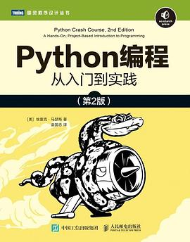

# Python编程

> 作者: [[美\]埃里克·马瑟斯（Eric Matthes）](https://book.douban.com/search/埃里克·马瑟斯)
> 出版社: [人民邮电出版社](https://book.douban.com/press/2609)
> 出品方: [图灵教育](https://book.douban.com/producers/42)
> 副标题: 从入门到实践（第2版）
> 原作名: Python Crash Course, 2nd Edition: A Hands-On, Project-Based Introduction to Programming
> 译者: [袁国忠](https://book.douban.com/search/袁国忠)
> 出版年: 2020-10
> 页数: 476
> 定价: 109.8
> 装帧: 平装
> 丛书: [图灵程序设计丛书·Python系列](https://book.douban.com/series/50553)
> ISBN: 9787115546081



## 第一部分：基础知识

### 第一章 起步

### 第二章 变量和数据类型

### 第三章 列表简介

列表：一系列特定顺序排列的元素组合。在`Python`中使用`[]`来创建。

列表其实就是其他编程语言中所谓的数组。

由于列表是顺序存储，要访问某个某个元素，只需要通过该元素的索引（序号）即可：`list[index]`。同大多数编程语言一样，列表的索引是从0开始的。

列表数据是动态的，可以通过赋值语句修改某索引的元素值；

要想增加元素，可以使用`append`函数向列表末端增加元素，或是通过`insert`函数向指定索引后插入数据。

如果想要删除数据，则使用`del`关键字，删除指定索引元素即可。当然，同`append`在末尾增加元素一样，`pop`是在列表末尾删除元素。此外`remove`方法可以移除指定元素值，该方法是从0开始遍历列表，知道找到指定元素为止，执行移除并结束遍历。

另外，列表还有许多内置方法用于操作：

+ sort
+ sorted
+ reverse
+ len(list)

有一些注意事项需要关注：

+ 使用索引时如果超出列表长度，将会报错。

### 第四章 列表操作

使用`for in`循环来遍历列表。

使用`range()`函数来生成一系列数（数字列表），然后方便地编写`for`循环结构。

列表解析：`testList = [value ** 2 for value in range(1, 11)]`

一些有用的函数：

+ 切片：list[start: end]
+ 元祖：不可修改的列表，相当于常量。使用`()`来创建。

### 第五章 if语句

==, !=,  >= , <=, >, <

and, or

in, not in

+ if

+ if-else
+ if-elif-else

### 第六章 字典

列表是顺序存储的，元素性质基本都是一致的，而字典这种数据结构不是顺序存储，而是键值对组合，正如其名称一样，像是查字典一样，通过字典的键，就能快速查询到字典的值。列表通过索引来查询元素，而字典通过键查询，区别在于字典的键一般都是有具体含义的。`Python`中字典通过`{}`来创建。

除了用键来直接访问，还可以用过`get`函数来访问字典值。

通过`for k,v in dict`可以遍历字典。

`keys`函数返回字典所有键组成的列表。

`values`函数返回字典所有值组成的列表。

字典的值可以是字典、列表，因此嵌套结构是常用结构，也非常实用。

### 第七章 用户输入和while循环

```python
s = input('提示用户输入: ')

nunm = int(numStr)
```

```python
while bool:
    break;
    continue;
```

### 第八章 函数

```python
def fun():
    return !0

# 形参(形式参数)
def parameter(p):
    print(p)
# 实参(实际参数)
parameter('argument')

# 关键字参数
def keyParameter(key, val):
    pass;
keyParameter(key="name", val="Jinx")

# 参数默认值 - 让参数可选
def defaulParameter(val = 0):
    pass;

# 函数返回值
def defResult():
    return True

# 不固定参数 - 列表
def someParameter(*parameters):
    pass

# 不固定关键字参数 - 字典
def someKeyParameter(**keyParameters):
    pass

# 导入模块并使用模块内的函数
import pizza
pizza.make_pizza(9, 'mushrooms', 'green peppers', 'extra cheese')

from pizza import make_pizza
make_pizza(16, 'beef')

from pizza import make_pizza as xxx
xxx(16, 'beef')

import pizza as pizza2
from pizza import *
```

### 第九章 类

```python
class Dog:
    """somedog"""
    
    def __init__(self, name: str, age: int) -> None:
        """初始化name和age"""
        self.name = name
        self.age = age

    def sit(self):
        print(f'{self.name} is sitting now.')

    def roll_over(self):
        print(f'{self.name} rolled over!')
    
d = Dog('JinDou', 0.5)

print(d.age)
d.sit()
d.roll_over()

# 继承
class child(Supper):
    def __init__():
        super().__init__()
    
# 导入 - 同函数导入一致

# 类的编码风格
"""
+ 类名使用驼峰命名法，且类名首字母都大写，而不适用下划线，对应的，示例和模块名都使用小写，并在单词之间使用下划线分割。
+ 类的描述
+ 适当使用空行来组织代码：函数之间使用一行空行；类之间使用两行空行；导入库时，系统库和自定义库以空行分开
"""
```

### 第十章 文件和异常

```python
# with结构可以自动关闭文件打开状态，类似与try...except...finally中的try...finally结构
with open('pi_digits.txt') as file_object:
    content = file_object.read()
print(content)

# 逐行读取
with open('src/data/pi_digits.txt') as file_object:
    for line in file_object:
        print(line.rstrip())
        
# 行列表
with open('src/data/pi_digits.txt') as file_object:
    txtLines = file_object.readlines()

for line in txtLines:
    print(line.rstrip())
   
# 写入文件
"""
+ w - 写入模式
+ a - 附加模式
+ r+ - 读写模式
"""
open('src/data/pi_digits.txt', 'w').write('...')
```

```python
# 处理异常
try-exception-finally
```

```python
# 存储数据
import json

numbers = [2, 3, 4, 5, 7, 11, 13]

filename = 'numbers.json'
with open(filename, 'w') as f:
    json.dump(numbers, f)
```

### 第十一章 测试代码

```python
import unittest
# 继承；test_xxx开头的函数名；unittest.main函数执行测试(如何做到子类调用子类函数的？)

# 类的测试
# setUp()函数
```

## 第二部分：项目

### 外星人入侵（第12-14章）

#### 第十二章 武装飞船

> 玩家控制居于游戏屏幕底部的一搜飞船，可使用方向键左右移动调整位置，使用空格键向飞船正前方发射子弹，用于击落屏幕上方会一波接一波出现的外星人，当外星人到达屏幕底部时，将损坏一搜飞船，当全部三艘飞船全被损坏时游戏结束。

+ 安装pygame
+ 创建pygame窗口：提供游戏绘制的载体
  + 响应用户输入
  + 窗口设置：背景色等
  + 设置类
  + 加载飞船

### 数据可视化（第15-17章）


### Web应用（第18-20章）
